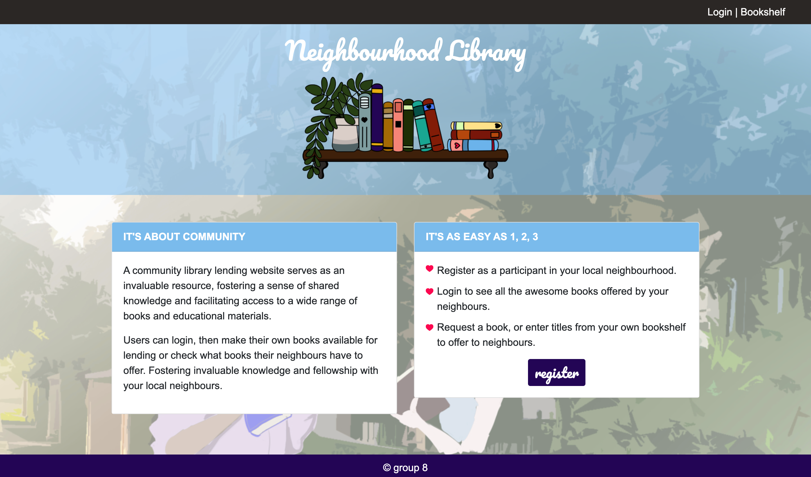

# Neighbourhood Library 

## Description

We created a neighbourhood library service. Users can register as a member of the neighbourhood, then both offer their books to be lent and review what books their neighbours have available for them to borrow. 

The site will help foster a community within a neighbourhood, and bring people together over a common passion for reading.

Future expansion goals include:
 
- expand to multiple neighbourhoods
- address validation

## Tech Used

- Express
- Node
- Heroku
- Bootstrap
- QR Codes
- node-qrcode

## Usage

File can used and shared to for knowledge expansion or general use as required. 

Screenshots: 

 

## Credit

- Starter code by a-nyx from 12-Stu_Connect-Node
- node-qrcode (https://www.npmjs.com/package/qrcode)
- Creating QR Codes Resource (https://blog.logrocket.com/create-read-qr-codes-node-js/)

## Links

- GitHub repository URL: https://github.com/cherah-petra/NeighbourhoodLibrary
- Heroku Page: https://neighbourhood-library-65950eb0f456.herokuapp.com/
